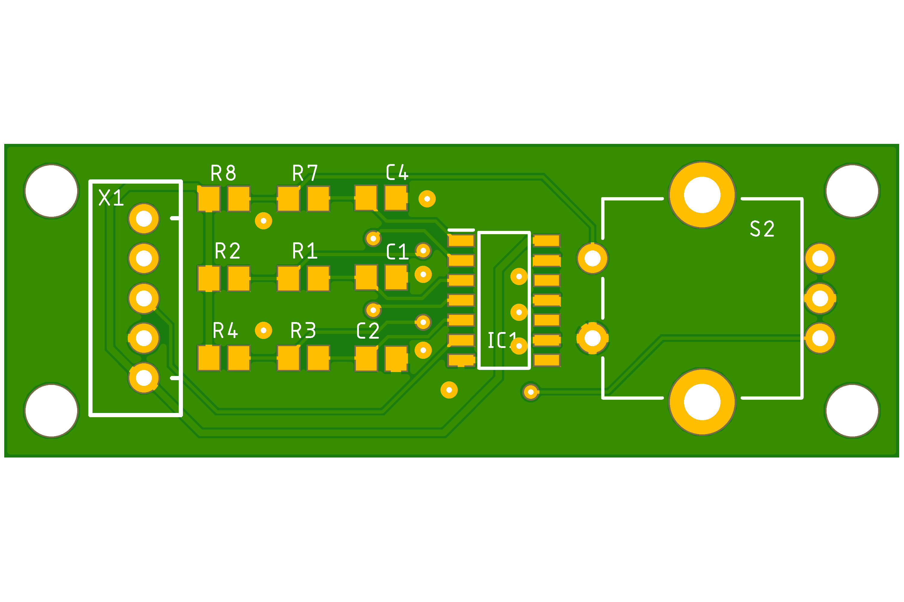

# TempGuardFirmwareV2
PID Temperature Controller dsPIC33EV64GM004 Hardware/Firmware 

Initial requirements were to control the temperature of an enclosed system, holding it as close as possible to a set temperature during operation. Venting air out of the enclosure using a FAN would quickly bring the temperature inside the enclosure to match the outside temperature which was unacceptable. Using an MCU we can monitor the temperature and vent air using a fan at a controlled rate. PID algorythms are commonly used in such systems - ['A proportional–integral–derivative controller (PID controller or three-term controller) is a control loop mechanism employing feedback that is widely used in industrial control systems and a variety of other applications requiring continuously modulated control.'](https://en.wikipedia.org/wiki/Proportional%E2%80%93integral%E2%80%93derivative_controller)

[dsPIC33EV64GM004](https://www.microchip.com/en-us/product/dsPIC33EV64GM004) MCU using 20MHz oscllator, configured with 140MHz FOSC ( 70 MIPS ). This device was selected based on pincount, cost and flexibility of its peripherals. It is presented in a surface mount 44pin quad flat pack that is easily hand solderable, along with a respectable 64k of flash and 8k RAM.

- 4 Input Capture devices for interfacing with temp sensors supporting [DHT11](docs/DHT11-Technical-Data-Sheet-Translated-Version-1143054.pdf) and [DHT22](docs/DHT22.pdf) protocols
- 3 2-Channel PWM devices running at 25KHz for controlling [4pin PWN fans](docs/4_Wire_PWM_Spec.pdf). Support for 3pin and 2pin fans using PWM on power pin if required
- 1 UART for communication, loggin with a host, configured at 9600 8N1
- 11 GPIOs connected to [2004 LCD (HD44780)](docs/HD44780.pdf) driven using 8bit Data, RS, RW and Enable, reading busy-flag to ensure maximum output throughput
- 12 GPIOs
  - 2 dedicated to rotary encoder ( GPIO4, GPIO5 )
  - 1 dedicated to a button ( GPIO3 )
  - 3 Inputs used to read TACH from 4PIN and 3PIN fans to calculate RPM 
  - 3 Output to FETs used as low-side switches controlling the FAN 12V power in the case of 3pin and 2pin fans and for power off control of 4pin fans
- 3 spare GPIO0, GPIO1, GPIO2 which can be used for notification of ALARM conditions, ie. FAN not spinning or Sensor not returning data.
- 3 Timers
  - TMR1 used as system timer used to monitor 10ms tick for scheduling
  - TMR3 used by PWM hardware
  - TMR4 used as high frequency timer with 7.3us tick

The system runs with a simple co-operative multitasking round-robin scheduler with a 10ms tick rate and ability to use a second high resultion timer with a 7us period. Tasks can be scheduled with or without a period, added and removed during operation. All tasks are non-blocking.

User interaction is through an LCD display current value from the attached temp sensors and fans. A rotary encoder and button can be used to navigate menus and change settings.

The LCD is updated from an in memory buffer at >120 times a second.

Ouput is also sent via UART over USB for logging purposes.

The firmware was developed usng the Microchip tools, [MPLABX](https://www.microchip.com/en-us/tools-resources/develop/mplab-x-ide) (v6.10) using [XC16](https://www.microchip.com/en-us/tools-resources/develop/mplab-xc-compilers/xc16) (v2.10) compiler and [MCC](https://www.microchip.com/en-us/tools-resources/configure/mplab-code-configurator) (v5) used to generate system, clock and initialisation code for hardware peripherals.

The firmware is written to the MCU in-circuit using a Microchip [Pickit5](https://www.microchip.com/en-us/development-tool/PG164150). Using the Pickit5 it is also possible to do source level debugging of the MCU while in-circuit.

For test and verification the first version of the device was coded on a dsPIC33EV64GM002 28pin DIP version of the device and soldered onto stripboard, the results for a 40minute session were logged, once the enclosure reached the required set temperature their was little to no deviation seen over the 40minutes.

## Hardware/Enclosure

